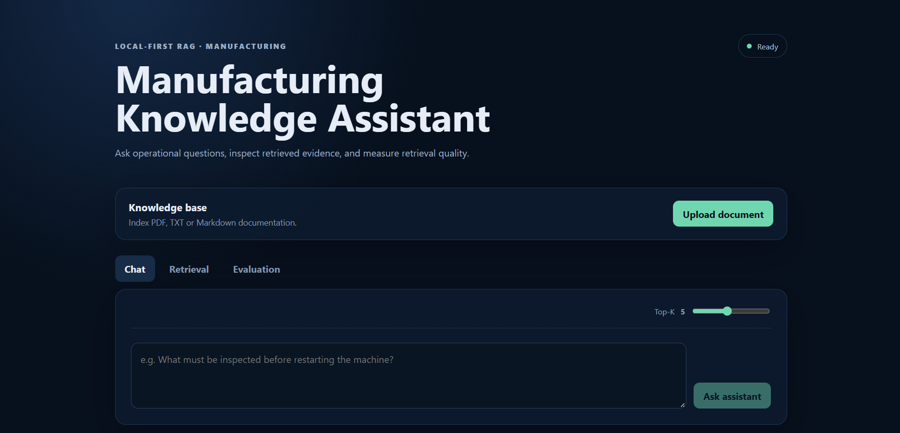
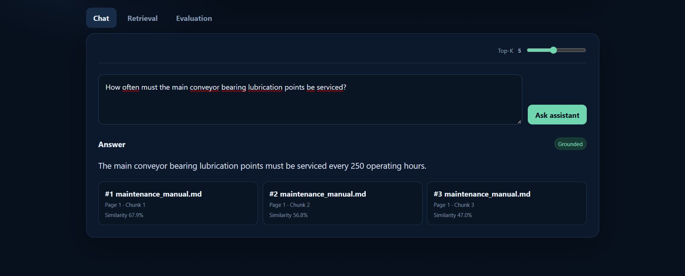
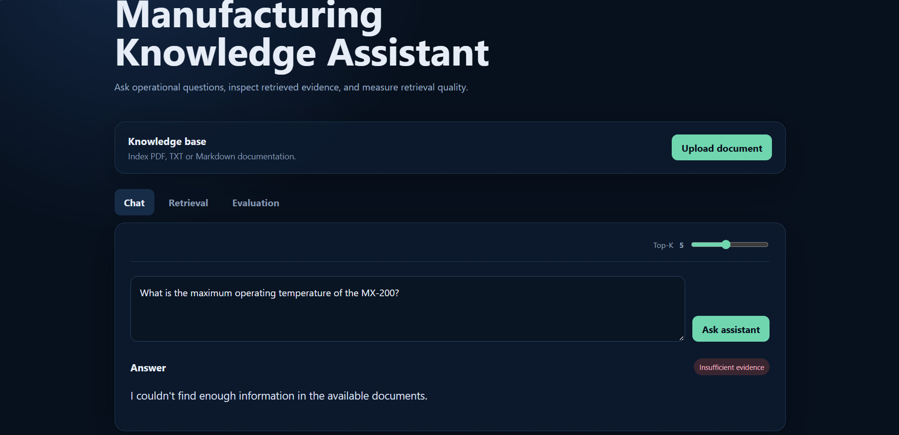

# Manufacturing Knowledge Assistant

[](https://github.com/jospindev-stack/manufacturing-knowledge-assistant/actions/workflows/backend-ci.yml)
[](https://github.com/jospindev-stack/manufacturing-knowledge-assistant/actions/workflows/frontend-ci.yml)

A **local-first Retrieval-Augmented Generation (RAG) assistant** for manufacturing documentation. Upload technical documents, index them as semantic vectors, retrieve the most relevant evidence, and generate grounded answers with explicit source citations using a local LLM.

The project deliberately keeps the RAG pipeline explicit instead of hiding retrieval behind a large framework. It is designed as a practical demonstration of document ingestion, embeddings, vector search, grounded generation, evaluation, API design, testing, and containerization.

<p align="center">
  
</p>

<p align="center">
  <a href="docs/assets/demo-rag.mp4"><strong>▶ Watch the end-to-end demo</strong></a>
</p>\n\n### Initial synthetic benchmark\n\nOn the first clean run of the included 6-question synthetic evaluation set at **Top-K = 5**, retrieval achieved **100% Hit Rate@5 (6/6)** and **0.917 MRR**. Five questions retrieved the expected evidence at rank 1 and one at rank 2. These figures describe that recorded demonstration run, not a production-quality benchmark.

## What it demonstrates

- PDF, TXT, and Markdown document ingestion
- configurable overlapping text chunking
- local Sentence Transformers embeddings
- persistent ChromaDB vector storage with source/page/chunk metadata
- cosine-similarity Top-K semantic retrieval
- grounded answer generation with Ollama / Llama
- explicit citations returned with generated answers
- refusal behavior when retrieved evidence is below the relevance threshold
- retrieval evaluation with **Hit Rate@K** and **Mean Reciprocal Rank (MRR)**
- React/TypeScript playground for chat, retrieval inspection, uploads, and evaluation
- FastAPI REST API and interactive Swagger documentation
- backend and frontend GitHub Actions CI
- Docker Compose local environment with persistent data volumes

## Architecture

```text
                        +----------------------+
                        |   React / TypeScript |
                        |      RAG Playground  |
                        +----------+-----------+
                                   |
                                   | HTTP
                                   v
+-------------+          +---------+----------+
| PDF/TXT/MD  +--------->|      FastAPI       |
+-------------+ upload   +---------+----------+
                                   |
                      +------------+-------------+
                      |                          |
                      v                          v
             +--------+---------+       +--------+---------+
             | Chunking +       |       | RAG orchestration|
             | Sentence         |       | retrieval ->     |
             | Transformers     |       | context -> LLM   |
             +--------+---------+       +--------+---------+
                      |                          |
                      v                          v
             +--------+---------+       +--------+---------+
             | ChromaDB         |       | Ollama / Llama   |
             | persistent       |       | local generation |
             | vector store     |       +------------------+
             +------------------+
```

### RAG flow

```text
Document
   -> extraction
   -> overlapping chunks
   -> embeddings
   -> ChromaDB

Question
   -> query embedding
   -> Top-K semantic search
   -> relevance filtering
   -> context construction
   -> Ollama generation
   -> grounded answer + sources
```

The retrieval and generation stages remain separate so retrieval quality can be inspected and evaluated independently from the LLM response.

## Tech stack

| Layer | Technology |
| --- | --- |
| API | Python 3.12, FastAPI, Pydantic |
| Embeddings | Sentence Transformers |
| Vector database | ChromaDB |
| Local LLM | Ollama + Llama 3.2 3B |
| Frontend | React, TypeScript, Vite |
| Frontend serving | Nginx |
| Testing | Pytest |
| CI | GitHub Actions |
| Containers | Docker, Docker Compose |

## Quick start with Docker

### Requirements

- Docker Desktop or Docker Engine with Compose
- enough disk space to download the local Ollama model

Clone the repository and start the stack:

```bash
git clone https://github.com/jospindev-stack/manufacturing-knowledge-assistant.git
cd manufacturing-knowledge-assistant
docker compose up --build
```

The first startup takes longer because the `ollama-init` service downloads `llama3.2:3b`. The model is persisted in a Docker volume and does not need to be downloaded again on every startup.

Once running:

| Service | URL |
| --- | --- |
| RAG playground | http://localhost:5173 |
| FastAPI | http://localhost:8000 |
| Swagger / OpenAPI | http://localhost:8000/docs |
| Ollama | http://localhost:11434 |

Stop the environment with:

```bash
docker compose down
```

Use `docker compose down -v` only when you intentionally want to remove the persisted Chroma, document, and Ollama volumes.

## Run without Docker

### Backend

```bash
cd backend
python -m venv .venv
```

Activate the virtual environment, then:

```bash
pip install -r requirements.txt
uvicorn app.main:app --reload
```

Ollama must be available locally at `http://localhost:11434` unless `OLLAMA_BASE_URL` is changed.

### Frontend

```bash
cd frontend
npm ci
npm run dev
```

The frontend defaults to `http://localhost:8000` for the API. Override it with `VITE_API_BASE_URL` when needed.

## API

### Health

```http
GET /api/health
```

### Upload and index a document

```http
POST /api/documents/upload
Content-Type: multipart/form-data
```

Supported formats: `.pdf`, `.txt`, `.md`.

Uploading a document triggers extraction, chunking, embedding generation, and indexing into ChromaDB.

### Semantic search

```http
GET /api/search?q=What%20PPE%20is%20required&top_k=5
```

This endpoint exposes retrieval directly, including source metadata and similarity values. It is useful for debugging the retrieval stage independently from generation.

### Grounded chat

```http
POST /api/chat
Content-Type: application/json

{
  "question": "What PPE is required for routine mechanical maintenance?",
  "top_k": 5
}
```

The service retrieves evidence first. If no retrieved chunk reaches the configured relevance threshold, the LLM is not asked to invent an answer and the response is marked as not grounded.

### RAG behavior in practice

The playground exposes both the generated answer and the evidence used to produce it. In the grounded example below, the assistant retrieves the maintenance manual and answers from the cited chunks.

<p align="center">
  
</p>

The generation layer also has an explicit insufficient-evidence path. When the retrieved context does not contain the requested fact, the assistant returns the standard not-found response instead of presenting an unsupported answer as grounded.

<p align="center">
  
</p>

### Retrieval evaluation endpoint

```http
POST /api/evaluation/retrieval
Content-Type: application/json
```

The repository includes a small synthetic evaluation dataset under `evaluation/` and non-proprietary manufacturing documents under `examples/documents/`.

## Retrieval evaluation

The project evaluates retrieval separately from generation. Given a question and its expected source, the evaluator checks where the expected evidence appears in the Top-K results.

**Hit Rate@K** measures the fraction of evaluation questions for which the expected source appears within the first K retrieved chunks.

**Mean Reciprocal Rank (MRR)** rewards retrieval systems that place the expected evidence closer to rank 1:

```text
MRR = mean(1 / rank_of_first_relevant_result)
```

The recorded initial demonstration run, using the included 6-question synthetic dataset with **Top-K = 5**, produced **100% Hit Rate@5 (6/6)** and **0.917 MRR**: five expected sources appeared at rank 1 and one at rank 2.\n\nThe corpus is intentionally small and synthetic, so these metrics demonstrate that the evaluation pipeline works; they should not be interpreted as a production benchmark or as evidence of general-domain retrieval quality. Re-indexing a source is idempotent, preventing repeated uploads from accumulating duplicate vectors and contaminating later rank-based evaluations.

## Synthetic demonstration data

`examples/documents/` contains original synthetic manufacturing documentation covering:

- preventive machine maintenance
- maintenance safety and hazardous-energy isolation
- production quality and traceability

These files exist specifically so the RAG pipeline can be demonstrated without publishing proprietary company documentation.

## Configuration

Backend settings can be supplied through environment variables or `backend/.env`:

```env
OLLAMA_BASE_URL=http://localhost:11434
OLLAMA_MODEL=llama3.2:3b
RETRIEVAL_TOP_K=5
RETRIEVAL_MIN_SIMILARITY=0.35
CORS_ORIGINS=http://localhost:5173
```

Inside Docker Compose, the backend communicates with Ollama through the internal service address `http://ollama:11434`.

Frontend configuration:

```env
VITE_API_BASE_URL=http://localhost:8000
```

## Tests and CI

Run backend tests locally:

```bash
cd backend
python -m pytest -q
```

Build the frontend locally:

```bash
cd frontend
npm ci
npm run build
```

GitHub Actions automatically runs backend tests and the frontend TypeScript/Vite build on pull requests and pushes to `main`.

## Project structure

```text
manufacturing-knowledge-assistant/
├── .github/workflows/       # backend and frontend CI
├── backend/
│   ├── app/
│   │   ├── api/             # FastAPI routes
│   │   ├── core/            # runtime configuration
│   │   ├── schemas/         # API contracts
│   │   └── services/        # ingestion, embeddings, retrieval, RAG, evaluation
│   ├── tests/
│   └── Dockerfile
├── evaluation/              # retrieval evaluation questions
├── examples/documents/      # synthetic manufacturing documents
├── frontend/
│   ├── src/
│   └── Dockerfile
├── docker-compose.yml
└── README.md
```

## Design decisions

**Local-first inference.** Ollama keeps document context and generation local and removes the requirement for a paid cloud LLM API key.

**Explicit RAG pipeline.** Retrieval, context construction, and generation are visible application services rather than a single opaque framework call. This makes failures easier to reason about and explain.

**Embedded ChromaDB.** The portfolio-sized application does not need a separate vector-database server. Chroma persists locally and receives its own Docker volume.

**Retrieval before generation.** A useful RAG system must retrieve the correct evidence before the LLM can produce a grounded answer. The dedicated search and evaluation endpoints make that behavior observable.

**Synthetic portfolio data.** Demonstration documents are intentionally non-proprietary and do not reproduce employer documentation.

## Current scope

This project is intentionally focused on a solid, explainable RAG baseline. It does not add agents, GraphRAG, Kubernetes, cloud infrastructure, or reranking simply to increase the technology count.

Potential future improvements include calibrated retrieval thresholds, reranking experiments, richer document management, and a larger evaluation corpus.

## License

This is a personal portfolio project. All source code and synthetic demonstration data were created specifically for this project. A formal open-source license has not yet been added.
